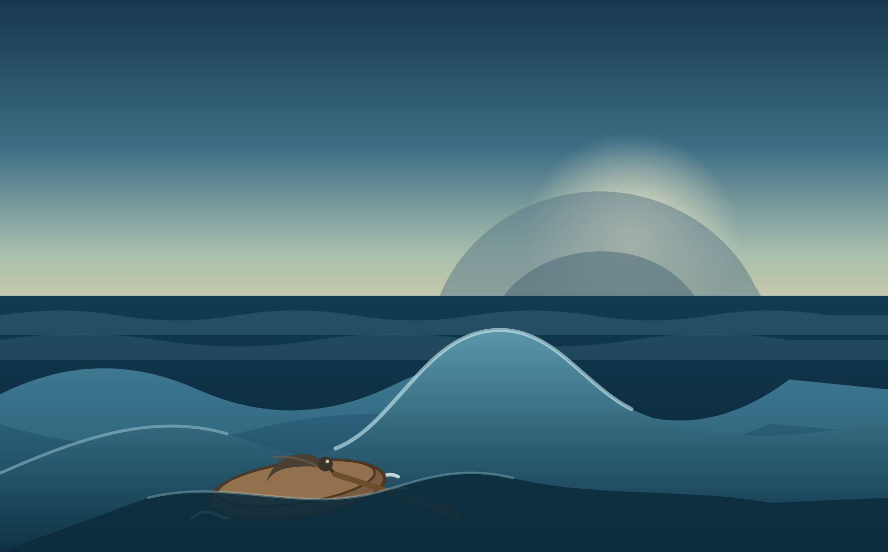

# Treasure Island — The Coracle in Choppy Water

From *Treasure Island* by Robert Louis Stevenson, Part Five ("My Sea Adventure"), Chapter 24: "The Cruise of the Coracle."

There was a great, smooth swell upon the sea. The wind blowing steady and gentle from the south, there was no contrariety between that and the current, and the billows rose and fell unbroken.

Had it been otherwise, I must long ago have perished; but as it was, it is surprising how easily and securely my little and light boat could ride. Often, as I still lay at the bottom, and kept no more than an eye above the gunwale, I would see a big blue summit heaving close above me; yet the coracle would but bounce a little, dance as if on springs, and subside on the other side into the trough as lightly as a bird.

I began after a little to grow very bold and sat up to try my skill at paddling. But even a small change in the disposition of the weight will produce violent changes in the behaviour of a coracle. And I had hardly moved before the boat, giving up at once her gentle dancing movement, ran straight down a slope of water so steep that it made me giddy, and struck her nose, with a spout of spray, deep into the side of the next wave.

I was drenched and terrified, and fell instantly back into my old position, whereupon the coracle seemed to find her head again and led me as softly as before among the billows.

I found each wave, instead of the big, smooth glossy mountain it looks from shore or from a vessel's deck, was for all the world like any range of hills on dry land, full of peaks and smooth places and valleys. The coracle, left to herself, turning from side to side, threaded, so to speak, her way through these lower parts and avoided the steep slopes and higher, toppling summits of the wave.

"Well, now," thought I to myself, "it is plain I must lie where I am and not disturb the balance; but it is plain, also, that I can put the paddle over the side, and from time to time, in smooth places, give her a shove or two towards land." No sooner thought upon than done. There I lay on my elbows, in the most trying attitude, and every now and again gave a weak stroke or two to turn her head to shore.

Source: [Treasure Island (1883)/Chapter 24 – Wikisource](https://en.wikisource.org/wiki/Treasure_Island_(1883)/Chapter_24)
